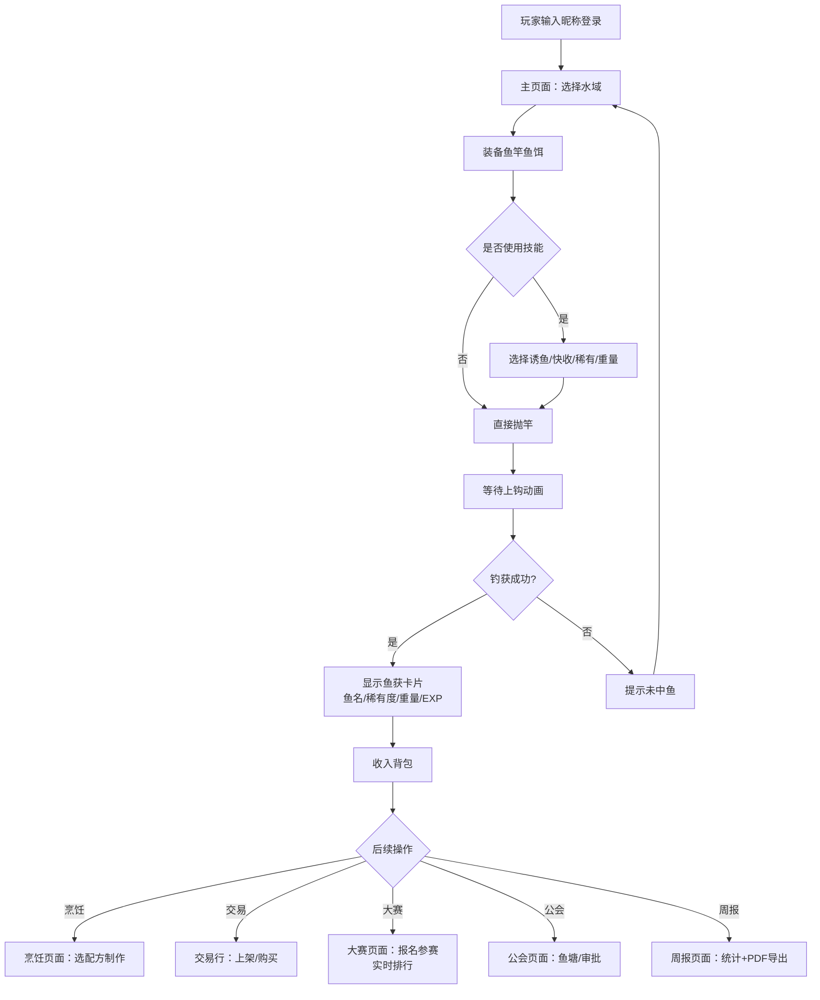

# 多人在线钓鱼游戏 Web 版 产品需求文档 (PRD)

## 1. 产品概述
一款基于浏览器的多人在线钓鱼模拟游戏 Web 应用，玩家可以在不同水域垂钓、参加每日定时垂钓大赛、烹饪料理、交易鱼获、经营公会鱼塘。产品面向休闲游戏玩家，目标是提供轻松有趣、社交互动性强的线上垂钓体验。

## 2. 核心功能

### 2.1 用户角色

| 角色 | 注册方式 | 核心权限 |
|------|---------|---------|
| 普通玩家 | 输入昵称一键登录 | 钓鱼、烹饪、交易、加入公会、参与大赛 |
| 公会管理员 | 公会成员升级 | 审批鱼饵配方、审批鱼塘建筑升级、管理成员 |
| 公会会长 | 创建公会时自动担任 | 所有管理员权限 + 转让会长、解散公会 |

### 2.2 功能模块
1. **主页面（钓鱼页）**：玩家信息栏、水域选择、抛竿钓鱼动作、鱼获提示、背包/鱼获面板
2. **交易市场页面**：在售列表、搜索筛选（按类型/价格/物品）、上架、购买、建议价提示
3. **烹饪页面**：已学配方列表、所需鱼材料、制作料理、使用料理获得 Buff
4. **公会页面**：公会信息展示、专属鱼塘入口、成员列表、审批队列、鱼塘升级
5. **垂钓大赛页面**：当前大赛倒计时、实时排行榜（重量+稀有度分）、奖励预览、报名按钮、比赛观战
6. **排行榜页面**：总重量榜、收集度榜、烹饪等级榜三个 Tab
7. **周报页面**：最近一周钓获统计、水域鱼种分布图、效率趋势图、PDF 下载按钮

### 2.3 页面详情

| 页面名称 | 模块名称 | 功能描述 |
|---------|---------|---------|
| 主页面 | 玩家信息栏 | 显示昵称、等级、金币、当前鱼竿、当前鱼饵 |
| 主页面 | 水域选择器 | 4大水域（翠绿湖泊/银色河流/迷雾河/深邃海洋）+ 公会专属鱼塘，点击切换 |
| 主页面 | 抛竿按钮 | 大号抛竿按钮，可选择使用技能（诱鱼/快收/重量加成/稀有度加成） |
| 主页面 | 鱼获反馈 | 浮漂动画 → 上钩提示 → 钓获结果卡片（鱼名/稀有度/重量/EXP） |
| 主页面 | 背包面板 | 已拥有的鱼、料理、材料、鱼竿鱼饵列表 |
| 交易市场 | 顶部筛选栏 | 物品类型（鱼/料理/鱼饵/材料）、价格区间、搜索框 |
| 交易市场 | 在售列表 | 卡片式展示，显示物品名、数量、单价、卖家、7日建议价区间 |
| 交易市场 | 购买弹窗 | 确认数量、总价、手续费说明，一键购买 |
| 交易市场 | 上架弹窗 | 选择物品、数量、定价，系统提示建议价区间 |
| 烹饪页面 | 配方列表 | 左侧配方卡片，显示图标、名称、等级需求、Buff 说明 |
| 烹饪页面 | 制作面板 | 右侧显示所需鱼材料（拥有/需求）、制作按钮、烹饪等级进度 |
| 烹饪页面 | 我的料理 | 已制作料理库存、使用按钮 |
| 公会页面 | 公会信息头 | 公会名、等级、会长、成员数、鱼塘等级、稀有鱼加成 |
| 公会页面 | 成员管理 | 成员列表（昵称/职位/总重量）、提升/降职/踢出 |
| 公会页面 | 审批中心 | 鱼饵配方审核（批准/拒绝）、建筑升级审核 |
| 公会页面 | 专属鱼塘 | 鱼塘等级、当前鱼种、升级按钮与消耗 |
| 大赛页面 | 倒计时横幅 | 下一场大赛倒计时或当前比赛剩余时间，附报名/观战按钮 |
| 大赛页面 | 实时排行榜 | 排名、玩家名、总重量、稀有度分、总分，实时刷新（WebSocket） |
| 大赛页面 | 奖励预览 | Top3 奖励（图纸/稀有鱼饵/金币/材料）、参与奖励 |
| 排行榜 | 三个 Tab | 总重量榜 / 收集度榜 / 烹饪等级榜，Top100，自身排名高亮 |
| 周报 | 统计总览 | 本周总钓获、总重量、最活跃水域、Top 钓手 |
| 周报 | 鱼种分布 | 按水域分组的柱状图/饼图展示鱼种比例 |
| 周报 | 效率趋势 | 7 天折线图：日平均单重、日钓获数 |
| 周报 | 导出按钮 | 一键下载 PDF 周报 |

## 3. 核心流程

玩家进入游戏 → 输入昵称登录 → 在主页面选择水域 → 装备鱼竿/鱼饵 → 点击抛竿（可选择技能）→ 等待上钩 → 查看鱼获并收入背包 → 可选：去烹饪页面用鱼做料理 → 可选：去交易行上架鱼或购买材料 → 可选：加入公会获得专属鱼塘 → 在大赛时间报名参加垂钓大赛 → 实时查看排行榜 → 赛后领取奖励 → 每周查看周报并下载 PDF。

## 4. 用户界面设计

### 4.1 设计风格
- **主色调**：深海蓝（#0a2540）为主色，水青绿（#1abc9c）为强调色，金色（#f1c40f）用于稀有物品高亮
- **辅助色**：浅水蓝（#3498db）按钮、珊瑚红（#e74c3c）警告、浅灰（#f5f7fa）背景
- **按钮风格**：圆角（12px）+ 微妙渐变 + hover 上浮 2px + 波纹点击反馈
- **字体**：标题使用「ZCOOL KuaiLe / 站酷快乐体」活泼字体，正文使用「PingFang SC / 系统无衬线」
- **布局风格**：左侧垂直导航栏 + 右侧主内容区，卡片式布局，大量圆角与柔和阴影
- **图标风格**：Emoji + 自定义 SVG 鱼/鱼竿/水滴图标，整体偏卡通游戏化
- **整体氛围**：深海蓝渐变背景 + 细微水波纹纹理 + 浮动气泡动画，营造水下垂钓氛围

### 4.2 页面设计概览

| 页面名称 | 模块名称 | UI 元素 |
|---------|---------|---------|
| 主页面 | 抛竿区 | 中央大抛竿按钮（水青渐变），周围环形技能按钮；背景动态水波纹；鱼漂 SVG 动画 |
| 主页面 | 鱼获卡片 | 稀有度对应颜色发光边框（普通灰/优秀绿/稀有蓝/史诗紫/传说金），飞入背包动画 |
| 主页面 | 水域选择器 | 横向滚动卡片，每张卡有缩略图、等级、天气图标、当前鱼种数 |
| 交易市场 | 列表卡片 | 左图右文，价格醒目金色，建议价区间为浅灰小字，稀有度标签 |
| 烹饪页面 | 配方卡片 | 左侧菜品插图 + 名称；右下星级；底部材料列表（绿色=足够，红色=不足） |
| 大赛页面 | 实时排行榜 | 前三名有奖杯图标与金色/银色/铜色背景，数据每 1s 平滑刷新 |
| 周报页面 | 图表区 | ECharts 饼图（鱼种分布）、折线图（效率趋势），卡片式容器带玻璃拟态效果 |

### 4.3 响应式
- 桌面端：左侧固定导航（220px），右侧内容区最大宽度 1200px 居中
- 平板端：导航折叠为顶部汉堡菜单
- 移动端：单列布局，抛竿按钮放大至屏宽 70%，触摸优化按钮最小 44×44px

