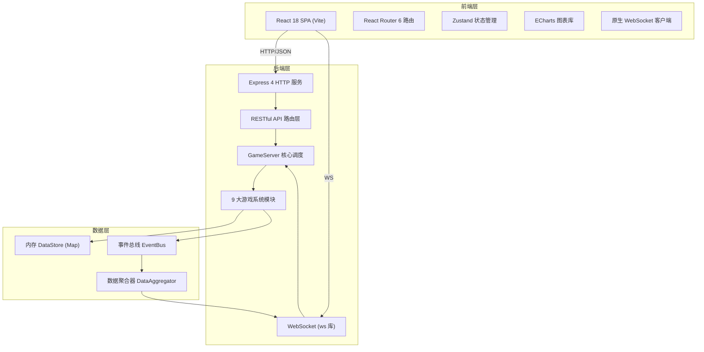
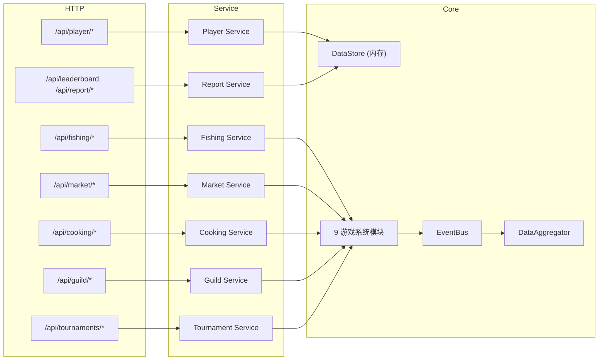
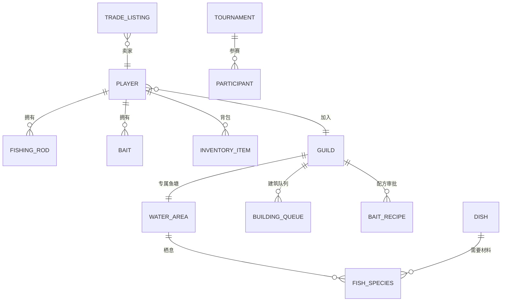

# 多人在线钓鱼游戏 Web 版 技术架构文档

## 1. 架构设计



## 2. 技术说明
- **前端框架**：React@18 + TypeScript@5 + Vite@5
- **前端样式**：TailwindCSS@3 + 自定义 CSS 变量主题
- **前端状态**：Zustand@4 全局玩家/游戏状态 + React Query 服务端缓存
- **图表**：ECharts@5（鱼种分布饼图、效率趋势折线图）
- **HTTP 通信**：Axios
- **实时通信**：原生 WebSocket API（大赛实时排行、全服公告）
- **后端**：Node.js + Express@4（REST API） + ws@8（WebSocket）
- **游戏核心**：已实现的 9 大系统（FishingEngine / TournamentSystem / TradeMarketSystem 等）
- **数据存储**：内存 Map（DataStore），周报 PDF 输出到磁盘

## 3. 路由定义

| 路由 | 页面 | 说明 |
|------|------|------|
| `/` | 主页面（钓鱼页） | 默认页面，抛竿钓鱼主界面 |
| `/market` | 交易市场 | 浏览、购买、上架物品 |
| `/cooking` | 烹饪中心 | 料理配方与制作 |
| `/guild` | 公会页面 | 公会信息、鱼塘、审批 |
| `/tournament` | 垂钓大赛 | 报名、实时排行、奖励 |
| `/leaderboard` | 全服排行榜 | 三榜切换 |
| `/report` | 周报表 | 统计图表与 PDF 下载 |

## 4. API 定义

### 4.1 玩家相关
```typescript
// POST /api/player/login
interface LoginReq { nickname: string }
interface LoginRes { player: Player; token: string }

// GET  /api/player/:id
interface GetPlayerRes { player: Player }

// GET  /api/player/:id/inventory
interface InventoryRes { fishes: Record<string, number>; dishes: Record<string, number>; materials: Record<string, number> }
```

### 4.2 钓鱼相关
```typescript
// GET  /api/water-areas
interface ListAreasRes { areas: WaterArea[]; currentWeather: Record<string, WeatherType> }

// POST /api/fishing/cast
interface CastReq { playerId: string; waterAreaId: string; skill?: SkillType }
interface CastRes { success: boolean; fishId?: string; fishName?: string; rarity?: FishRarity; weight?: number; expGained?: number }

// POST /api/rod/upgrade
interface UpgradeReq { playerId: string; rodInstanceId: string }
interface UpgradeRes { success: boolean; rod?: FishingRod; reason?: string }
```

### 4.3 交易市场
```typescript
// GET  /api/market/listings
interface ListReq { itemType?: string; itemId?: string; minPrice?: number; maxPrice?: number }
interface ListRes { listings: TradeListing[] }

// POST /api/market/listings
interface CreateListingReq { sellerId: string; itemType: string; itemId: string; quantity: number; unitPrice: number }
interface CreateListingRes { success: boolean; listing?: TradeListing; suggestedRange?: { min: number; max: number } }

// POST /api/market/listings/:id/buy
interface BuyReq { buyerId: string; quantity?: number }
interface BuyRes { success: boolean; totalCost?: number; itemsReceived?: number }

// GET  /api/market/suggested-price?itemType=xxx&itemId=xxx
interface PriceRes { min: number; max: number; avg: number; median: number; sampleSize: number }
```

### 4.4 烹饪
```typescript
// GET  /api/cooking/recipes?playerId=xxx
interface RecipesRes { available: Dish[]; learned: string[] }

// POST /api/cooking/cook
interface CookReq { playerId: string; dishId: string }
interface CookRes { success: boolean; dish?: Dish; expGained?: number }
```

### 4.5 公会
```typescript
// GET  /api/guild/:id
interface GuildRes { guild: Guild; pond?: WaterArea }

// POST /api/guild/create
interface CreateGuildReq { leaderId: string; name: string }
interface CreateGuildRes { success: boolean; guild?: Guild }

// POST /api/guild/pond/upgrade
interface UpgradePondReq { playerId: string }
interface UpgradePondRes { success: boolean; rareFishBonus?: number }

// POST /api/guild/approve/:queueType/:index
interface ApproveReq { adminId: string; action: 'approved' | 'rejected' }
```

### 4.6 大赛
```typescript
// GET  /api/tournaments
interface TournamentsRes { active: Tournament[]; upcoming: Tournament[] }

// POST /api/tournaments/:id/register
interface RegisterReq { playerId: string }
interface RegisterRes { success: boolean }

// GET  /api/tournaments/:id/leaderboard?limit=50
interface LeaderboardRes { participants: TournamentParticipant[]; remainingMs: number; status: TournamentStatus }
```

### 4.7 排行榜与周报
```typescript
// GET  /api/leaderboard?type=total_weight|collection|cooking_level&limit=100
interface LbRes { entries: LeaderboardEntry[]; myRank?: number }

// GET  /api/report/weekly
interface WeeklyReportRes { report: WeeklyReport }

// GET  /api/report/weekly/pdf   (返回 application/pdf)
```

## 5. 服务端架构图



## 6. 数据模型

### 6.1 数据模型定义


### 6.2 数据定义说明
- **核心实体**：Player / Guild / WaterArea / FishSpecies / FishingRod / Bait / Tournament / TradeListing / Dish / BaitRecipe / WeeklyReport
- **枚举定义**：WaterAreaType（湖/河/海/公会）、WeatherType（6种天气）、TimeOfDay（6个时段）、FishRarity（5级稀有度）、TournamentStatus、SkillType（5种技能）、GuildRole、ApprovalStatus
- **存储方式**：全部基于内存 `Map<string, T>` 存储，tradeHistory / catchHistory / cookingHistory 用数组保存时间序列数据用于周报统计与均价计算

